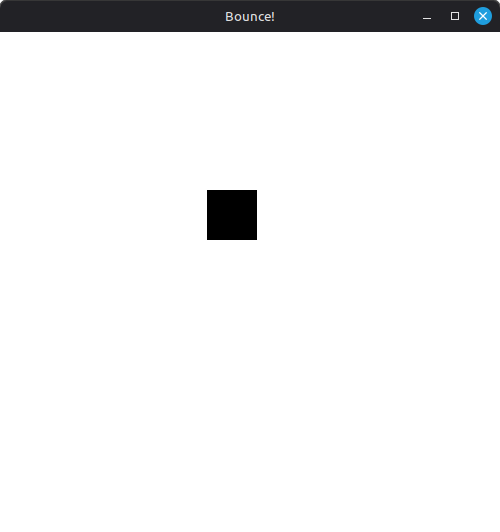
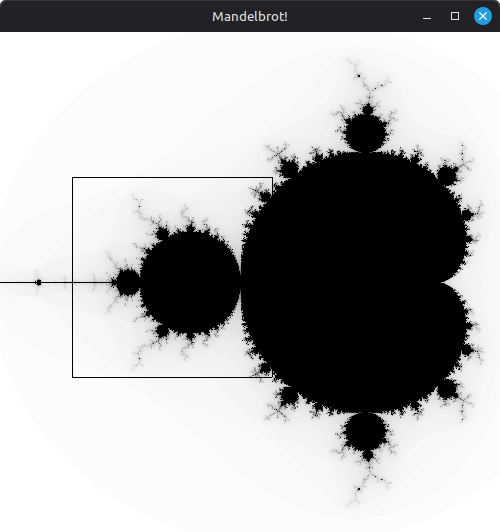
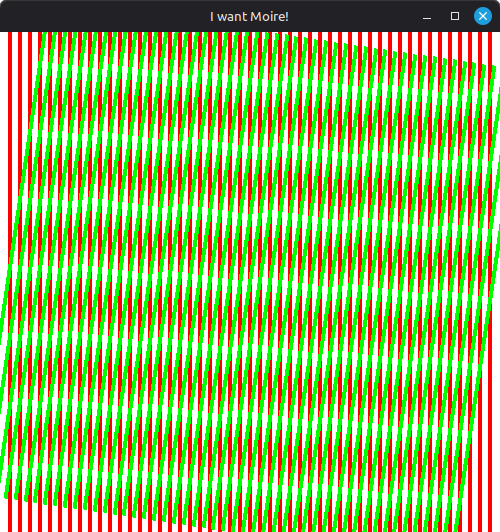
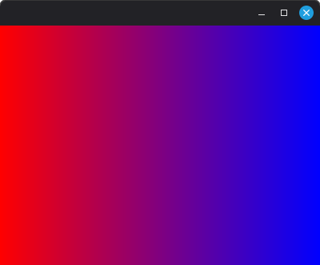

# xtest
Experimenting with Xlib! And C in general...

## Screenshots

<table style="padding:10px">
	<tr>
		<td>  </td>
		<td>  </td>
	</tr>
	<tr>
		<td>  </td>
		<td>  </td>
	</tr>
	<tr>
		<td>  </td>
	</tr>
</table>
